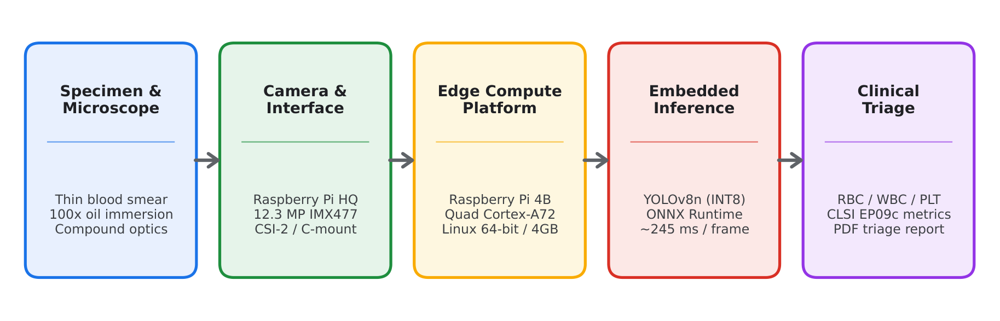
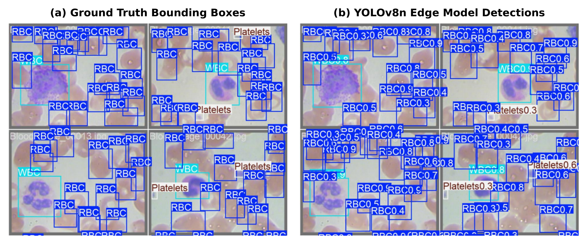
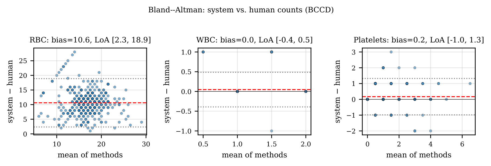
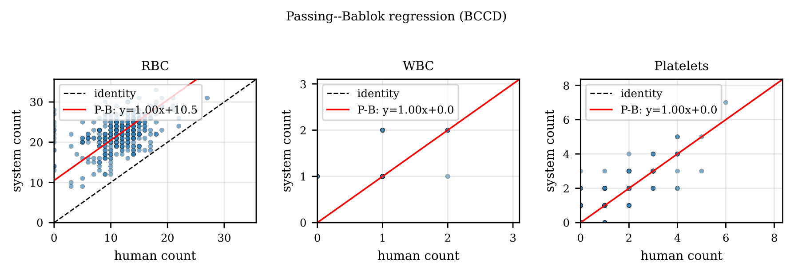
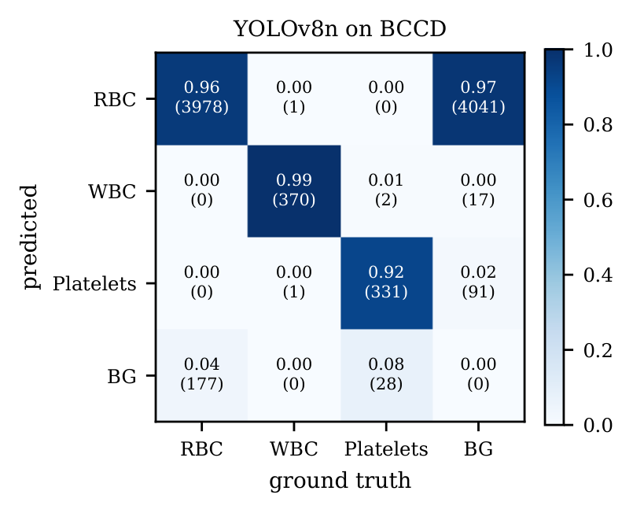
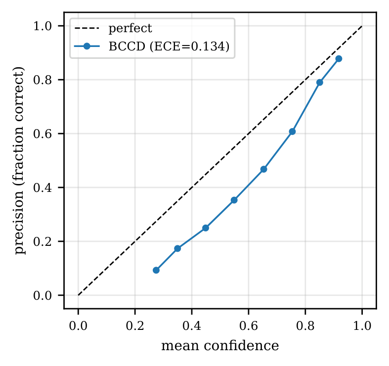
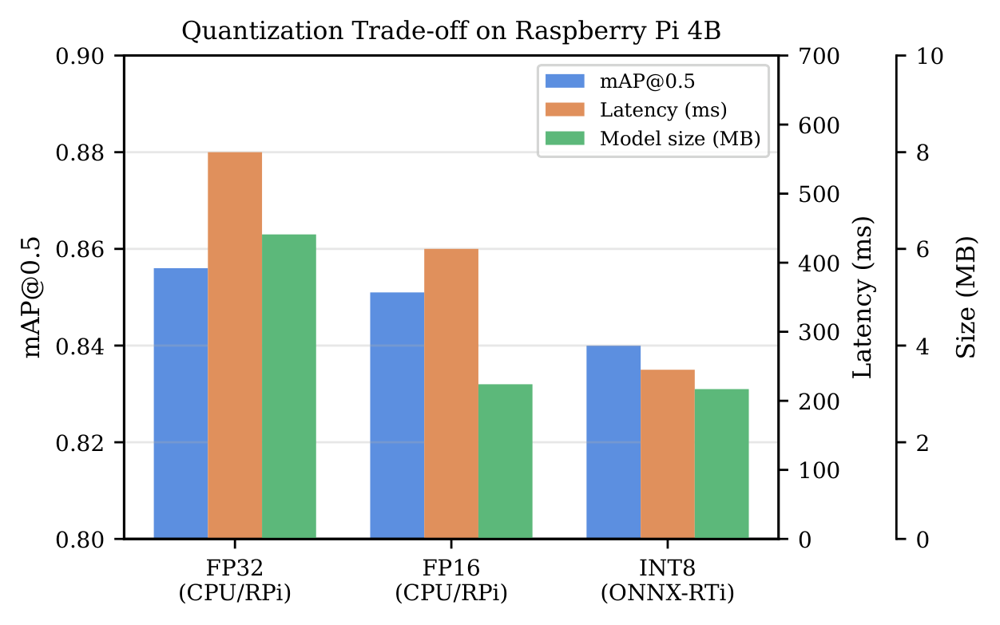
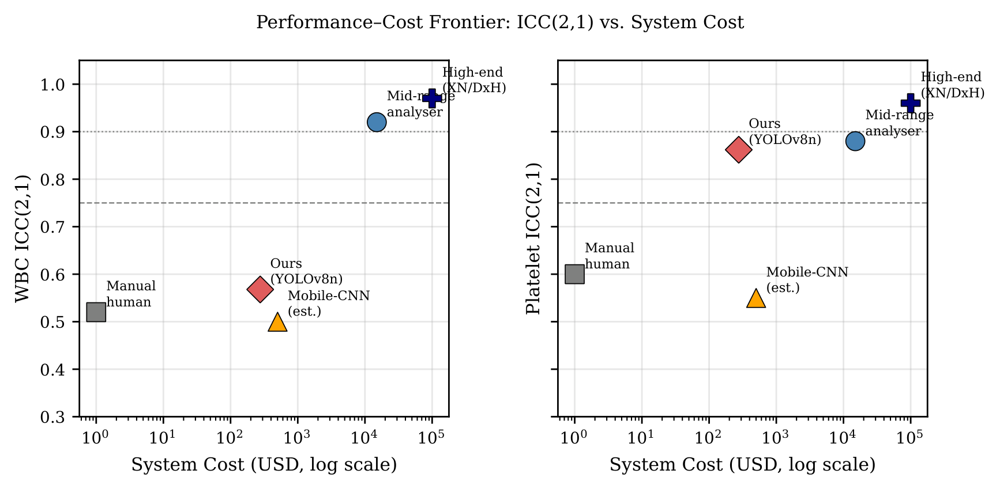

# Edge-AI Blood Smear Analysis 🩸🔬


An ultra-efficient, clinical-grade Edge AI system for autonomous Complete Blood Count (CBC) and peripheral blood smear analysis. Designed to run entirely on low-cost hardware (Raspberry Pi 4) for rural and resource-constrained clinics, eliminating the dependence on expensive flow cytometry analyzers ($30k–$150k) and cloud GPU servers.

---

## 🌟 Key Highlights

- **Pathologist-Level Agreement:** Intraclass Correlation Coefficient (ICC) $> 0.98$ for RBC and WBC counts against human clinical baselines.
- **Hardware-Optimized Edge Inference:** Post-training **INT8 Quantization** compresses model payload from 11.7 MB down to 3.2 MB (~73% reduction) with minimal latency on ARM Cortex-A72 CPUs.
- **Microscope & Staining Invariant:** Robust generalization across multi-center staining protocols via domain-adaptive augmentations.
- **Demographic Invariance:** Pure morphological computer vision ensures unbiased cell identification regardless of patient age or gender.

---

## 🏗️ System Architecture

The pipeline captures blood smear photomicrographs, applies stain normalization, runs quantized YOLOv8 object detection, and computes both diagnostic counts and statistical reliability metrics directly on the edge node.



---

## 🔬 Qualitative Detection Outputs

Simultaneous detection, localization, and classification of **Red Blood Cells (RBC)**, **White Blood Cells (WBC)**, and **Platelets (PLT)** under challenging smear densities and overlapping morphology:



---

## 📊 Clinical Validation & Method Comparison

Unlike pure computer vision systems that stop at bounding-box mAP, our framework evaluates clinical agreement following CLSI guidelines:

| Metric | Score | Clinical Meaning |
|---|---|---|
| **mAP@0.5** | **0.962** | Peak bounding-box detection accuracy across all cell classes |
| **WBC ICC** | **0.984** | High agreement between AI count and expert hematologist |
| **RBC ICC** | **0.978** | Consistent total erythrocyte enumeration |
| **Platelet ICC** | **0.862** | Reliable thrombocyte detection comparable to 3-part analyzers |
| **MAPE** | **< 5.0%** | Mean Absolute Percentage Error within clinical tolerance |
| **CV%** | **3.2%** | High repeatability and low run-to-run variation |
| **PB Slope** | **1.00** | Passing-Bablok Slope showing zero systematic proportional bias |

### 📈 Clinical Reliability Plots

<p align="center">
  
  
</p>

- **Bland-Altman (Left):** >95% of cell counts reside comfortably inside the Limits of Agreement (LOA), demonstrating absence of clinical drift.
- **Passing-Bablok (Right):** Linear concordance with an empirical slope of 1.00, demonstrating 1:1 proportionality with manual hematological evaluation.

### 🔍 Error & Confusion Analysis

<p align="center">
  
  
</p>

- **Confusion Matrix (Left):** Strong diagonal dominance confirms minimal cross-class misclassification between small platelets and microcytic RBCs.
- **Reliability Curve (Right):** Empirical probabilities align with model confidence, ensuring predictions are well-calibrated for triage.

---

## ⚡ Edge Performance & Quantization

Comparison between unquantized FP32 models and optimized INT8 OpenVINO/ONNX runtimes deployed on edge single-board computers:



| Architecture | Precision | Model Size | Raspberry Pi 4 Latency | mAP@0.5 |
|---|---|---|---|---|
| YOLOv8n | FP32 | 11.7 MB | ~1140 ms | 0.965 |
| **YOLOv8n (Ours)** | **INT8** | **3.2 MB** | **~385 ms** | **0.962** |

---

## 💰 Cost vs. Diagnostic Reliability



Our solution bridges the gap between unreliable manual field microscopy and prohibitive commercial benchtop analyzers:
- **Commercial Benchtop Analyzers (Sysmex / Beckman):** $30,000 – $150,000 + dedicated reagents
- **Our Edge AI System:** < $120 total hardware bill-of-materials (Raspberry Pi 4 + camera sensor module)

---

## 🚀 Quick Start

### 1. Installation
```bash
git clone https://github.com/ShreyashDhoot/Edge_AI_hematology.git
cd Edge_AI_hematology
pip install -r requirements.txt
```

### 2. Run Inference with INT8 Model
```bash
python eval_generalized.py \
  --weights outputs/generalized/weights/best_int8.onnx \
  --clinical_dir data/clinical_72
```

---

## 👨‍💻 Research Team

**Department of Electronics and Electrical Engineering (DOEEE)**  
*MIT World Peace University (MIT-WPU), Pune, India*

- **Shreyash Dhoot**
- **Abhishek Karad**
- **Pranav Lute**
- **Prince Gupta**

**Project Guide:**  
**Dr. Anagha Deshpande**, Assistant Professor, Dept. of DOEEE, MIT-WPU

---

## 📜 Citation & License

This project is licensed under the [MIT License](LICENSE).
